# Caso 3 · Procesamiento de Eventos en Tiempo Real — PayFlow

---

##  Ficha del Proyecto

| Campo | Detalle |
|---|---|
| **Institución** | Tecnológico de Antioquia — Institución Universitaria |
| **Curso** | Computación en la Nube · Semestre 2026-1 |
| **Caso** | 03 — Procesamiento de Eventos en Tiempo Real |
| **Empresa** | PayFlow (Fintech colombiana) |
| **Plataforma** | Microsoft Azure (Free Tier / Azure for Students) |


---

## Integrantes

| Nombre |
|---|
| Erika Restrepo |
| Esteban Ramírez |
| Katerine Pino |

---

##  Estructura del Repositorio

```
/
├── README.md     → Documento principal con toda la documentación
├── /src/         → Código fuente: Azure Functions y scripts Python
└── /assets/      → Imágenes de diagramas C4 y capturas de pantalla
```

---

## Control de Cambios

| ID | Responsable | Sección | Observación / Cambio | Fecha |
|---|---|---|---|---|
| 01 | Julian David Florez | — | Creación del documento base | 02/05/2026 |
| 02 | Erika Restrepo | Definición Arquitectura | Estructura inicial del repositorio, portada y análisis del caso | 21/05/2026 |
| 03 | Erika Restrepo | Definición Arquitectura | Problemas, requerimientos, restricciones y stack de servicios | 21/05/2026 |
| 04 | Erika Restrepo | Modelamiento - Diagramas C4 | Diagramas C1, C2 y C3 con notación C4 correcta | 21/05/2026 |
| 05 | Erika Restrepo | Decisiones Arquitectónicas - ADRs | 5 ADRs finalizados con contexto, alternativas y trade-offs | 21/05/2026 |
| 06 | Erika Restrepo | Revisión de la ruta crítica | Implementación completa con evidencias en Azure | 22/05/2026 |
| 07 | Erika Restrepo | Revisión de la ruta crítica | Entrega final: flujo completo, conclusiones y ajustes | 22/05/2026 |
---

## Análisis del Caso

### 1. Descripción de PayFlow

PayFlow es una **fintech colombiana** fundada en 2020 que actúa como intermediario de pagos digitales entre comercios, adquirentes bancarios y redes de pago (Visa, Mastercard, PSE). Procesa transacciones de compra, reembolsos, pagos de servicios y transferencias entre cuentas.

**Cifras de operación actuales:**

| Indicador | Valor |
|---|---|
| Comercios activos | 28.000 |
| Transacciones diarias (promedio) | 85.000 |
| Transacciones en temporada alta | hasta 260.000 por día |
| Presencia geográfica | Colombia, Ecuador y Perú |

---

### 2. Problemas Identificados en la Arquitectura Actual

El sistema actual fue construido en 2020 sobre una **arquitectura síncrona y monolítica**. Cada transacción recorre un flujo secuencial de validación → autorización → registro → notificación, que debe completarse en menos de 3 segundos. Esta arquitectura presenta cinco problemas críticos:

| # | Problema | Descripción | Impacto en el negocio |
|---|---|---|---|
| P1 | **Cuello de botella en picos** | El procesador central maneja hasta 40 tx/s. En temporada alta el tiempo de respuesta sube a 8 segundos. | Rechazos en terminales de comercios y pérdida de ventas. |
| P2 | **Sin separación de flujos** | Una transacción de $500 COP y una de $50.000.000 COP tienen exactamente la misma prioridad. | Micropagos masivos bloquean transacciones de alto valor. |
| P3 | **Fraude reactivo** | Las reglas antifraude se aplican *después* de autorizar. Las alertas son manuales y revisadas horas después. | El dinero ya está comprometido cuando se detecta el fraude. |
| P4 | **Observabilidad limitada** | No existe monitoreo centralizado. El equipo se entera de fallos por quejas en WhatsApp. | Tiempo de detección de problemas muy alto; daño a la reputación. |
| P5 | **Acoplamiento notificación** | Si el webhook de notificación al comercio falla, la transacción completa se revierte aunque la autorización bancaria fue exitosa. | Inconsistencias entre el estado en PayFlow y la red de pago. |

---

### 3. Requerimientos de la Nueva Arquitectura

| Requerimiento | Métrica objetivo | Motivación |
|---|---|---|
| Throughput | 500 transacciones/segundo | Soportar picos de temporada alta sin degradación |
| Latencia de autorización | < 2 segundos en P99 | Evitar timeouts en terminales de comercios |
| Garantía de entrega | At-least-once para transacciones críticas | Ninguna transacción puede perderse en el flujo |
| Detección de fraude | Evaluación en tiempo real **antes** de autorizar | Reducir a $0 el fraude comprometido post-autorización |
| Desacoplamiento | Notificaciones independientes del flujo de autorización | Evitar que fallos de webhook reviertan autorizaciones válidas |
| Observabilidad | Alertas automáticas con latencia < 30 segundos | Detectar anomalías antes de que los comercios reporten |

---

### 4. Restricciones del Proyecto

| Restricción | Detalle |
|---|---|
| **Regulación SFC** | Todos los datos deben almacenarse en Colombia o regiones certificadas. Región Azure: **Brazil South**. |
| **Stack tecnológico** | El equipo tiene experiencia en Python y Node.js. Las Azure Functions deben implementarse en uno de estos lenguajes. |
| **Presupuesto** | Máximo **$60 USD/mes** en Azure durante la fase piloto. |
| **Integración no intrusiva** | El sistema legado continúa operando en paralelo. La nueva arquitectura recibe sus eventos sin requerir modificaciones en él. |
| **Cosmos DB Free Tier** | Puede estar ocupado (una cuenta por suscripción). Se evalúa alternativa en ADR-03. |
| **Enrutamiento diferenciado** | Transacciones superiores a **$5.000.000 COP** deben ir por un canal de alta prioridad con registro de auditoría obligatorio. |

---

### 5. Stack de Servicios Azure

| Servicio Azure | Responsabilidad en PayFlow | Tier |
|---|---|---|
| **Azure Event Hubs** | Punto de entrada del sistema. Recibe el flujo de eventos del sistema legado y canales digitales. Actúa como buffer distribuido ante picos de demanda. | Basic (1 TU, 1 día retención) |
| **Azure Functions** | Procesa cada evento: valida formato, aplica reglas antifraude, enruta según monto y tipo, escribe resultado en Cosmos DB. | Consumption Plan (1M ejecuciones/mes gratis) |
| **Azure Service Bus** | Gestiona el enrutamiento diferenciado de transacciones de alto valor (> $5M COP) con colas de prioridad, garantía de entrega y reintentos automáticos. | Basic (costo mínimo por operación) |
| **Cosmos DB** | Persiste el estado final de cada transacción procesada con escrituras de alta velocidad. Modelo de datos flexible. | Free Tier (1.000 RU/s, 25 GB) |
| **Azure Monitor + App Insights** | Observabilidad completa: throughput de Event Hubs, tasa de error de Functions, latencia por tipo de transacción y alertas automáticas. | Gratuito hasta 5 GB logs/mes |

---

### 6. Correspondencia Problema → Solución Arquitectónica

Esta tabla demuestra que cada problema identificado tiene una solución concreta en la nueva arquitectura. Este es el criterio transversal de coherencia de la rúbrica.

| Problema original | Cómo lo resuelve la nueva arquitectura |
|---|---|
| P1 — Cuello de botella en picos | **Azure Event Hubs** actúa como buffer distribuido. **Azure Functions** en Consumption Plan escala automáticamente hasta 500 tx/s sin intervención manual. |
| P2 — Sin separación de flujos | **Azure Service Bus** con cola diferenciada para alto valor. La function `enrutarPorMonto` separa explícitamente transacciones > $5M COP antes de procesarlas. |
| P3 — Fraude reactivo | La function `evaluarFraude` aplica reglas antifraude **antes** de autorizar, dentro del flujo síncrono de Event Hubs → Functions. |
| P4 — Observabilidad limitada | **Azure Monitor + Application Insights** provee alertas automáticas con latencia < 30 s. Reemplaza las quejas en WhatsApp por dashboards en tiempo real. |
| P5 — Acoplamiento notificación | **Azure Service Bus** desacopla completamente la notificación al comercio. La function `notificarComercio` opera de forma independiente; su fallo no revierte la autorización. |

---
## Arquitectura de Referencia Microsoft

Este caso está basado en las siguientes arquitecturas oficiales de Microsoft Azure:

- [Event-driven architecture](https://learn.microsoft.com/es-es/azure/architecture/guide/architecture-styles/event-driven)
- [Azure Event Hubs](https://learn.microsoft.com/es-es/azure/event-hubs/event-hubs-about)
- [Azure Functions](https://learn.microsoft.com/es-es/azure/azure-functions/functions-bindings-event-hubs)
- [Azure Service Bus](https://learn.microsoft.com/es-es/azure/service-bus-messaging/service-bus-messaging-overview)
- [Azure Cosmos DB](https://learn.microsoft.com/es-es/azure/cosmos-db/introduction)
- [Azure Monitor](https://learn.microsoft.com/es-es/azure/azure-monitor/overview)
---

##  Modelo C4

### C1 — Diagrama de Contexto

El diagrama C1 muestra a PayFlow como sistema central, los actores del negocio y los sistemas externos con los que se integra.

#### Actores del negocio

| Actor | Rol en el sistema |
|---|---|
| **Comercio** | Inicia transacciones de compra, reembolso y pago de servicios a través de terminales POS y canales digitales. Es el actor principal. |
| **Adquirente bancario** | Entidad financiera que autoriza o rechaza cada transacción. PayFlow se comunica con él para obtener la autorización bancaria. |
| **Equipo de riesgo** | Monitorea patrones de fraude. Con la nueva arquitectura recibe alertas automáticas en tiempo real en lugar de revisarlas manualmente horas después. |
| **Equipo de operaciones** | Gestiona la salud del sistema. Recibe métricas y alertas automáticas desde Azure Monitor en lugar de enterarse por quejas en WhatsApp. |

#### Sistemas externos

| Sistema | Rol |
|---|---|
| **Sistema legado (monolito 2020)** | Fuente actual de eventos de transacciones. Se integra de forma no intrusiva a través de Azure Event Hubs, sin requerir modificaciones. |
| **Red de pagos (Visa / Mastercard / PSE)** | Procesa el enrutamiento final de cada transacción hacia la red de pago correspondiente. |
| **Terminales POS** | Puntos de venta físicos de los comercios. Reciben respuesta de autorización o rechazo en menos de 2 segundos (P99). |

#### Diagrama


> _Elaborado en draw.io con librería C4. Exportado y disponible en /assets/c1-contexto.png_

*Diagrama C1 — Contexto del sistema PayFlow. Muestra los actores del negocio (Comercio, Adquirente Bancario, Equipo de Riesgo, Equipo de Operaciones) y los sistemas externos (Sistema Legado, Red de Pagos, Terminales POS) que interactúan con la Plataforma de Pagos. Elaborado en draw.io con notación C4.*

> 
---

### C2 — Diagrama de Contenedores

El diagrama C2 muestra los cinco servicios Azure que componen la nueva arquitectura de PayFlow, el flujo de eventos entre ellos y el sistema legado como fuente externa.

#### Servicios y responsabilidades

| Contenedor | Responsabilidad | Protocolo | Tier |
|---|---|---|---|
| **Buffer de Eventos** | Punto de entrada. Recibe eventos del sistema legado y canales digitales. Buffer distribuido ante picos de hasta 500 tx/s. | AMQP | Basic (1 TU) |
| **Procesador de Transacciones** | Procesa cada evento: valida formato, evalúa fraude, enruta por monto y registra resultado. | AMQP / HTTP | Consumption Plan |
| **Cola de Alta Prioridad** | Canal diferenciado para transacciones > $5.000.000 COP. Garantía de entrega y reintentos automáticos. | AMQP | Basic |
| **Base de Datos de Transacciones** | Persiste el estado final de cada transacción con escrituras de alta velocidad. | HTTP/SDK | Serverless |
| **Sistema de Observabilidad** | Observabilidad completa: throughput, tasa de error, latencia y alertas automáticas < 30s. | HTTP | Gratuito 5GB/mes |

#### Flujo de eventos

1. El **Sistema Legado** publica eventos vía AMQP → **Buffer de Eventos** (~85.000 tx/día)
2. **Buffer de Eventos** dispara el **Procesador de Transacciones** por cada evento recibido
3. **Procesador de Transacciones** evalúa el monto:
   - Si es > $5.000.000 COP → enruta a **Cola de Alta Prioridad**
   - En todos los casos → escribe resultado en **Base de Datos de Transacciones**
4. **Sistema de Observabilidad** recibe métricas del Buffer de Eventos y Procesador en tiempo real

#### Diagrama

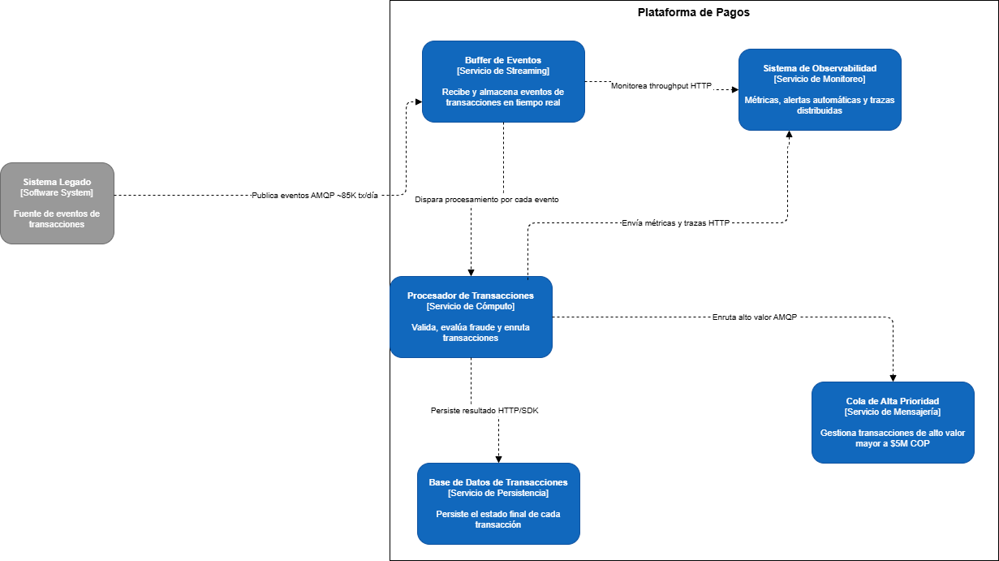

> _Elaborado en draw.io con librería C4. Exportado y disponible en /assets/c2-contenedores.png_

*Diagrama C2 — Contenedores de la Plataforma de Pagos PayFlow. Muestra los 5 contenedores internos sin nombres de servicios Azure (Buffer de Eventos, Procesador de Transacciones, Cola de Alta Prioridad, Base de Datos de Transacciones, Sistema de Observabilidad) y el Sistema Legado como fuente externa. Elaborado en draw.io con notación C4.*

---

### C3 — Diagrama de Componentes

El diagrama C3 muestra el interior de Azure Functions, con las 5 funciones individuales, su secuencia de ejecución y sus dependencias con Event Hubs, Service Bus y Cosmos DB.

#### Componentes individuales

| Componente | Responsabilidad | Trigger | Salida |
|---|---|---|---|
| **Validador de Formato** | Valida el formato del evento JSON y detecta datos inválidos o incompletos | Buffer de Eventos (AMQP) | Evento validado o rechazado |
| **Evaluador de Fraude** | Aplica reglas antifraude en tiempo real antes de autorizar la transacción | Resultado de Validador de Formato | Aprobado o en revisión |
| **Enrutador por Monto** | Si el monto supera $5.000.000 COP enruta a la Cola de Alta Prioridad | Resultado de Evaluador de Fraude | Mensaje en Cola de Alta Prioridad (AMQP) |
| **Registrador de Resultado** | Escribe el estado final de la transacción en la Base de Datos | Resultado de Evaluador de Fraude | Documento en Base de Datos (HTTP/SDK) |
| **Notificador de Comercio** | Envía webhook al comercio de forma desacoplada. Su fallo no revierte la autorización | Resultado de Registrador de Resultado | Webhook HTTP al comercio |

#### Flujo interno

```
┌─────────────────────────────────────────────────────────────┐
│               PROCESADOR DE TRANSACCIONES                   │
│                                                             │
│  [Buffer de Eventos] ──AMQP──► Validador de Formato         │
│                                        │                    │
│                                ¿Formato OK?                 │
│                                NO ──► Rechazada             │
│                                SI ──► Evaluador de Fraude   │
│                                            │                │
│                                     ¿Es fraude?             │
│                                     SI ──► En revisión      │
│                                     NO ──► Enrutador Monto  │
│                                                │            │
│                                     ¿Monto > $5M COP?       │
│                                     SI ──► [Cola Alta Prior.]│
│                                     NO ──► Registrador      │
│                                                │            │
│                                     [Base de Datos]         │
│                                                │            │
│                                     Notificador de Comercio │
│                                                │            │
│                                     Webhook al comercio     │
└─────────────────────────────────────────────────────────────┘

```

**Descripción de cada etapa:**

| Etapa | Componente Azure | Descripción |
|---|---|---|
| **1. Ingreso** | Azure Event Hubs (AMQP) | El evento de transacción llega desde el sistema legado al buffer distribuido. |
| **2. Validación de formato** | Azure Functions — `validarTransaccion` | Verifica que el payload tenga la estructura correcta. Si falla, la transacción se rechaza de inmediato. |
| **3. Evaluación de fraude** | Azure Functions — `evaluarFraude` | Aplica las reglas antifraude **antes** de autorizar. Si se detecta fraude, la transacción queda en revisión manual. Resuelve el problema P3. |
| **4. Enrutamiento por monto** | Azure Functions — `enrutarPorMonto` | Transacciones superiores a **$5.000.000 COP** se desvían a la cola de alta prioridad en Azure Service Bus. Resuelve el problema P2. |
| **5. Persistencia** | Azure Cosmos DB | El estado final de la transacción (`aprobada`, `rechazada`, `alto-valor`) se registra en el contenedor `transacciones`. |
| **6. Notificación desacoplada** | Azure Service Bus + `notificarComercio` | El webhook al comercio opera de forma independiente. Un fallo en esta etapa **no revierte** la autorización ya registrada. Resuelve el problema P5. |

#### Diagrama

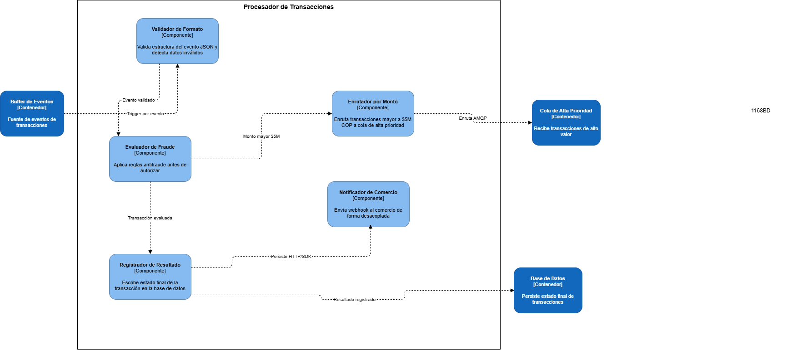

> _Elaborado en draw.io con librería C4. Exportado y disponible en /assets/c3-componentes.png_

*Diagrama C3 — Componentes internos del Procesador de Transacciones. Muestra los 5 componentes (Validador de Formato, Evaluador de Fraude, Enrutador por Monto, Registrador de Resultado, Notificador de Comercio) y sus dependencias con el Buffer de Eventos, Cola de Alta Prioridad y Base de Datos. Elaborado en draw.io con notación C4.*

### Diagrama Final — Arquitectura de Referencia Azure

El diagrama final muestra la arquitectura completa de PayFlow con los servicios Azure reales, sus logos oficiales y el flujo de eventos entre ellos.

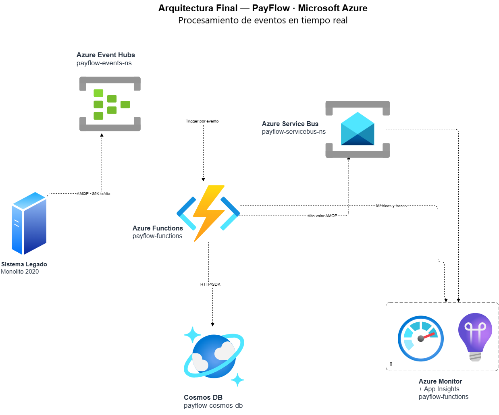
*Arquitectura final de PayFlow desplegada en Microsoft Azure — Brazil South. Muestra los 5 servicios Azure seleccionados: Azure Event Hubs (buffer de eventos), Azure Functions (procesador), Azure Service Bus (cola alto valor), Cosmos DB (persistencia) y Azure Monitor + App Insights (observabilidad), conectados mediante protocolo AMQP y HTTP con flechas punteadas que indican el flujo de eventos.*

---

## Decisiones Arquitectónicas (ADRs)

---

### ADR-01: Azure Event Hubs como punto de entrada de eventos de transacciones

**Fecha:** 21/05/2026
**Estado:** Aprobado

**Referencia oficial:** [Azure Event Hubs — ¿Qué es?](https://learn.microsoft.com/es-es/azure/event-hubs/event-hubs-about) | [Arquitectura event-driven](https://learn.microsoft.com/es-es/azure/architecture/guide/architecture-styles/event-driven)

#### Contexto

PayFlow recibe hasta 85.000 transacciones diarias con picos de hasta 260.000 en temporada alta. El sistema legado actual colapsa a partir de 40 transacciones por segundo. Se necesita un punto de entrada que actúe como buffer distribuido capaz de absorber picos de demanda sin perder eventos, y que se integre de forma no intrusiva con el sistema legado sin requerir modificaciones en él. La restricción de presupuesto de $60 USD/mes limita las opciones a tiers básicos.

#### Alternativas evaluadas

| Criterio | Azure Event Hubs | Azure Service Bus |
|---|---|---|
| **Modelo** | Streaming de eventos, alto volumen | Mensajería empresarial, cola de mensajes |
| **Throughput** | Hasta millones de eventos/segundo | Miles de mensajes/segundo |
| **Retención** | 1 día (Basic tier) | Hasta 14 días |
| **Orden estricto** | No garantizado | Garantizado por sesión |
| **Dead-letter queue** | No | Sí |
| **Costo Basic tier** | Muy bajo (~$0.028/millón de eventos) | Bajo (por operación) |
| **Integración legado** | Ideal para publicar eventos en masa | Mejor para mensajes individuales |

#### Decisión

Se elige **Azure Event Hubs** como punto de entrada del sistema.

Event Hubs es la opción correcta porque el problema de PayFlow es de **volumen y velocidad**, no de mensajería garantizada. El sistema legado necesita publicar eventos en masa sin modificaciones, y Event Hubs permite exactamente eso actuando como buffer distribuido. Service Bus está diseñado para mensajería empresarial con garantías de orden, lo cual es necesario en etapas posteriores del flujo (enrutamiento de alto valor) pero no en el punto de entrada. Según la [documentación oficial de Microsoft](https://learn.microsoft.com/es-es/azure/event-hubs/event-hubs-about), Event Hubs está diseñado para ingesta masiva de eventos en tiempo real, exactamente el caso de PayFlow.

#### Consecuencias

**Ventajas:**
- Absorbe picos de hasta 500 tx/s sin degradación
- Integración no intrusiva con el sistema legado
- Escala automáticamente sin intervención manual
- Costo mínimo en Basic tier dentro del presupuesto de $60 USD/mes

**Trade-offs:**
- No garantiza orden estricto de eventos (aceptable para el caso de PayFlow)
- Retención de solo 1 día en Basic tier (suficiente para el prototipo)
- No tiene dead-letter queue nativa (los errores se manejan en el Procesador de Transacciones)

---

### ADR-02: Azure Functions como motor de procesamiento de eventos

**Fecha:** 21/05/2026
**Estado:** Aprobado

**Referencia oficial:** [Azure Functions — trigger por Event Hubs](https://learn.microsoft.com/es-es/azure/azure-functions/functions-bindings-event-hubs)

#### Contexto

Cada evento que llega al Buffer de Eventos debe ser procesado: validar su formato, evaluar fraude, enrutar por monto y registrar el resultado. Se necesita un motor de procesamiento que escale automáticamente ante picos, que tenga un trigger nativo para Event Hubs, y que el equipo de ingeniería de PayFlow pueda implementar en Python o Node.js según la restricción del proyecto.

#### Alternativas evaluadas

| Criterio | Azure Functions | Azure Stream Analytics |
|---|---|---|
| **Modelo** | Procesamiento por evento individual | Procesamiento de streams con SQL |
| **Trigger Event Hubs** | Nativo y directo | Sí, como input |
| **Lenguajes** | Python, Node.js, C#, Java | Solo SQL-like (SAQL) |
| **Lógica de negocio** | Código completo, sin límites | Limitado a consultas analíticas |
| **Escalado** | Automático en Consumption Plan | Automático por Streaming Units |
| **Costo** | 1M ejecuciones/mes gratis | Desde $0.11/hora por SU |
| **Reglas antifraude** | Implementables en código | Muy limitadas en SQL |

#### Decisión

Se elige **Azure Functions** en plan **Consumo flexible** (Serverless).

Azure Stream Analytics está diseñado para análisis de streams con agregaciones y ventanas de tiempo, no para lógica de negocio compleja como validación de formato, reglas antifraude y enrutamiento condicional. Azure Functions permite implementar toda esta lógica en Python (lenguaje que domina el equipo de PayFlow), tiene trigger nativo para Event Hubs, escala automáticamente y tiene 1 millón de ejecuciones gratuitas al mes. Según la [documentación oficial](https://learn.microsoft.com/es-es/azure/azure-functions/functions-bindings-event-hubs), el trigger de Event Hubs para Functions es la forma recomendada de procesar eventos de forma escalable.

**Tier elegido:** Consumo flexible — escala a cero cuando no hay eventos, cobra solo por ejecución, soporta Python 3.11 en Linux.

#### Consecuencias

**Ventajas:**
- Implementación en Python, lenguaje del equipo de ingeniería
- Trigger nativo de Event Hubs sin configuración adicional
- Escalado automático hasta 500 tx/s
- Costo cero durante la fase piloto (1M ejecuciones gratis)
- Lógica antifraude implementable sin restricciones de lenguaje

**Trade-offs:**
- Cold start en la primera ejecución tras inactividad (latencia adicional de ~1s)
- Límite de tiempo de ejecución de 10 minutos por función (no es problema para transacciones)
- Requiere gestión del código fuente y despliegue


---

### ADR-03: Cosmos DB como base de datos de persistencia de transacciones

**Fecha:** 21/05/2026
**Estado:** Aprobado con condición

**Referencia oficial:** [Azure Cosmos DB — Introducción](https://learn.microsoft.com/es-es/azure/cosmos-db/introduction)

#### Contexto

Cada transacción procesada debe persistirse con su estado final (aprobada, rechazada o en revisión). El sistema procesa múltiples tipos de transacciones (compra, reembolso, pago de servicios, transferencias) con estructuras de datos distintas. Se requieren escrituras de alta velocidad y un modelo de datos flexible. Restricción importante: el Free Tier de Cosmos DB es uno por suscripción y puede estar ocupado por otro equipo de PayFlow.

#### Alternativas evaluadas

| Criterio | Cosmos DB | Azure SQL Database |
|---|---|---|
| **Modelo de datos** | NoSQL, documentos JSON flexibles | Relacional, esquema fijo |
| **Escrituras** | Muy alta velocidad (1.000 RU/s gratis) | Alta velocidad con índices |
| **Esquema** | Flexible, sin migraciones | Rígido, requiere migraciones |
| **Escalado** | Horizontal automático | Vertical principalmente |
| **Costo Free Tier** | 1.000 RU/s, 25 GB — 1 por suscripción | 32 GB — 1 por suscripción |
| **Latencia** | < 10ms en escritura | < 10ms con configuración |
| **Consultas complejas** | Limitadas en NoSQL | Completas con SQL |

#### Decisión

Se elige **Cosmos DB** en modo **Serverless** como primera opción.

Cosmos DB es la opción ideal porque el modelo de datos de PayFlow es heterogéneo (distintos tipos de transacciones con campos diferentes) y las escrituras de alta velocidad son críticas para cumplir la latencia < 2s en P99. El esquema flexible evita migraciones cada vez que se agrega un nuevo tipo de transacción. Se optó por el modo **Serverless** como alternativa al Free Tier, dado que puede estar ocupado por otro equipo de PayFlow en la misma suscripción — el modo Serverless cobra únicamente por las RU/s consumidas sin costo fijo mensual, manteniéndose dentro del presupuesto de $60 USD/mes.

**Condición:** antes de desplegar, verificar si el Free Tier de Cosmos DB está disponible en la suscripción. Si está ocupado, usar el modo Serverless como alternativa documentada aquí.

#### Consecuencias

**Ventajas:**
- Modelo de datos flexible para los distintos tipos de transacción de PayFlow
- Escrituras de alta velocidad con latencia < 10ms
- Modo Serverless cubre holgadamente el prototipo sin costo fijo
- Sin necesidad de migraciones de esquema

**Trade-offs:**
- Free Tier limitado a una cuenta por suscripción (puede estar ocupado)
- Consultas analíticas complejas son más difíciles que en SQL
- Si se usa SQL como alternativa, requiere definir esquema fijo desde el inicio

---

### ADR-04: Azure Service Bus para el enrutamiento de transacciones de alto valor

**Fecha:** 21/05/2026
**Estado:** Aprobado

**Referencia oficial:** [Azure Service Bus — Introducción](https://learn.microsoft.com/es-es/azure/service-bus-messaging/service-bus-messaging-overview)


#### Contexto

Las transacciones superiores a $5.000.000 COP deben enrutarse por un canal diferenciado con mayor prioridad de procesamiento y registro de auditoría obligatorio según las restricciones del caso. Se necesita un servicio que garantice la entrega de estos mensajes, soporte reintentos automáticos en caso de fallo y ofrezca dead-letter queue para los mensajes que no puedan procesarse.

#### Alternativas evaluadas

| Criterio | Azure Service Bus | Azure Storage Queue |
|---|---|---|
| **Garantía de entrega** | At-least-once garantizado | At-least-once garantizado |
| **Dead-letter queue** | Sí, nativa | No |
| **Reintentos automáticos** | Sí, configurables | No, manual |
| **Orden de mensajes** | Garantizado por sesión | No garantizado |
| **Tamaño máximo mensaje** | 256 KB (Basic) | 64 KB |
| **Tiempo retención** | Hasta 14 días | Hasta 7 días |
| **Costo** | Bajo por operación | Muy bajo por operación |
| **Auditoría** | Logs detallados | Logs básicos |

#### Decisión

Se elige **Azure Service Bus** para el enrutamiento de transacciones de alto valor.

Las transacciones de alto valor (> $5M COP) requieren garantías que Azure Storage Queue no puede ofrecer: dead-letter queue para capturar mensajes fallidos, reintentos automáticos configurables y logs de auditoría detallados. Dado que estas transacciones representan el mayor riesgo financiero para PayFlow, la robustez de Service Bus justifica su costo adicional sobre Storage Queue. Según la [documentación oficial](https://learn.microsoft.com/es-es/azure/service-bus-messaging/service-bus-messaging-overview), Service Bus es el servicio recomendado para mensajería empresarial con garantías de entrega.


#### Consecuencias

**Ventajas:**
- Dead-letter queue captura transacciones de alto valor que fallan en el procesamiento
- Reintentos automáticos sin intervención manual
- Registro de auditoría obligatorio cumplido por los logs de Service Bus
- Orden garantizado por sesión para transacciones del mismo comercio

**Trade-offs:**
- Costo ligeramente mayor que Storage Queue (mínimo por operación)
- Configuración más compleja que Storage Queue
- Basic tier no soporta topics (solo colas), suficiente para el prototipo

---

### ADR-05: Azure Monitor + Application Insights como solución de observabilidad

**Fecha:** 21/05/2026
**Estado:** Aprobado

**Referencia oficial:** [Azure Monitor — Introducción](https://learn.microsoft.com/es-es/azure/azure-monitor/overview)


#### Contexto

El sistema actual de PayFlow no tiene monitoreo centralizado. El equipo de operaciones se entera de los fallos por quejas de comercios en WhatsApp. El requerimiento es tener alertas automáticas con latencia menor a 30 segundos para detectar anomalías antes de que los comercios reporten. Se necesita observabilidad del throughput del Buffer de Eventos, tasa de error del Procesador de Transacciones y latencia por tipo de transacción.

#### Alternativas evaluadas

| Criterio | Azure Monitor + App Insights | Datadog / New Relic |
|---|---|---|
| **Integración Azure** | Nativa, sin configuración extra | Requiere agente y configuración |
| **Trazas distribuidas** | Automáticas en Functions | Requiere instrumentación manual |
| **Alertas** | Configurables, latencia < 30s | Configurables, latencia < 30s |
| **Costo** | Gratuito hasta 5 GB logs/mes | Desde $15/host/mes |
| **Dashboards** | Incluidos en Azure Portal | Muy completos pero de pago |
| **Curva de aprendizaje** | Baja (mismo portal Azure) | Media-alta |
| **Presupuesto piloto** | Dentro de $60 USD/mes | Fuera del presupuesto |

#### Decisión

Se elige **Azure Monitor + Application Insights** como solución de observabilidad.

La integración nativa con Azure es el factor decisivo. Application Insights se adjunta a Azure Functions con una sola línea de configuración y provee trazas distribuidas automáticas sin instrumentación manual. El costo es cero dentro del Free Tier (5 GB logs/mes), lo cual es fundamental dado el presupuesto de $60 USD/mes para la fase piloto. Datadog y New Relic son soluciones más completas pero están fuera del presupuesto y requieren configuración adicional. Según la [documentación oficial](https://learn.microsoft.com/es-es/azure/azure-monitor/overview), Azure Monitor es la solución nativa recomendada para observabilidad en el ecosistema Azure.


#### Consecuencias

**Ventajas:**
- Integración nativa con todos los servicios Azure del stack
- Trazas distribuidas automáticas en Azure Functions sin código adicional
- Alertas automáticas con latencia < 30s cumpliendo el requerimiento
- Costo cero en el Free Tier (5 GB logs/mes cubre el prototipo)
- Dashboard centralizado en el mismo portal Azure

**Trade-offs:**
- Menos funcionalidades avanzadas que Datadog o New Relic
- Los 5 GB gratuitos pueden limitarse en producción con alto volumen
- Vendor lock-in con el ecosistema Azure (migrar a otra nube requiere cambiar herramienta)


---

## Implementación del Flujo Crítico

### Paso 1 — Azure Event Hubs desplegado

Se creó el namespace `payflow-events-ns` en la región **Brazil South** con el hub de transacciones `transacciones` configurado con 2 particiones y retención de 1 día.

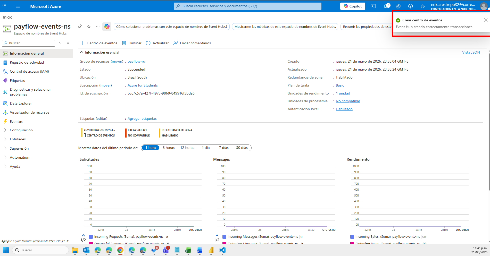
*Namespace de Azure Event Hubs `payflow-events-ns` desplegado en Brazil South con el hub `transacciones` creado. Plan Basic, 1 unidad de procesamiento, estado: Succeeded.*
---

### Paso 2 — Script Python generador de eventos

El script `src/generador_eventos.py` genera y publica 3 tipos de transacciones en Event Hubs:

-  **5 transacciones normales** (monto < $5.000.000 COP)
-  **3 transacciones de alto valor** (monto > $5.000.000 COP)
-  **2 transacciones con formato inválido** (para probar validación)

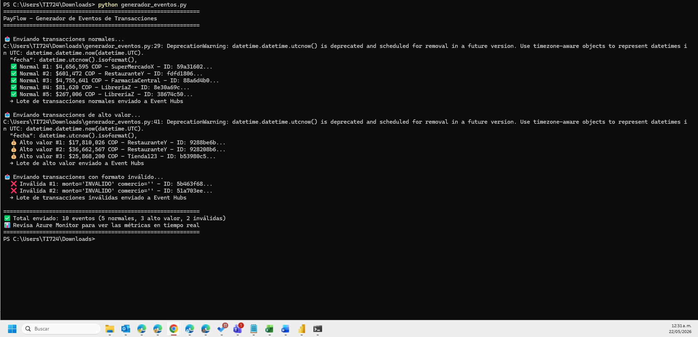
*Script Python ejecutándose en consola. Muestra el envío exitoso de 10 eventos: 5 normales, 3 de alto valor y 2 inválidas, todos publicados correctamente en Azure Event Hubs.*
---

### Paso 3 — Azure Functions desplegada y procesando eventos

Se creó y desplegó la función `validarTransaccion` en la Function App `payflow-functions` en **Brazil South** con Python 3.11 en plan Consumo flexible (Serverless).

**Configuración de integración:**
- **Trigger:** Azure Event Hubs (event) — escucha el hub `transacciones`
- **Función:** validarTransaccion — valida formato, evalúa fraude y enruta por monto

**Métricas de ejecución:**
- **Total de ejecuciones:** 20
- **Trigger:** Centro de eventos (Event Hubs)
- **Estado:** Habilitada ✅

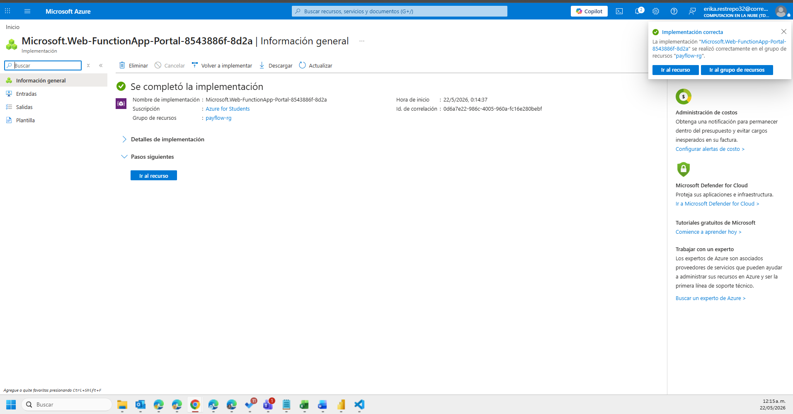
*Function App `payflow-functions` desplegada en Azure Portal. Estado: En ejecución, región: Brazil South, plan: Consumo flexible.*

.png)
*Vista adicional de la configuración de la Function App payflow-functions.*

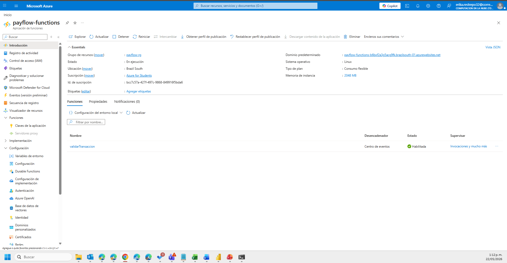
*Función `validarTransaccion` desplegada y habilitada. Trigger: Centro de eventos (Event Hubs). Estado: Habilitada.*

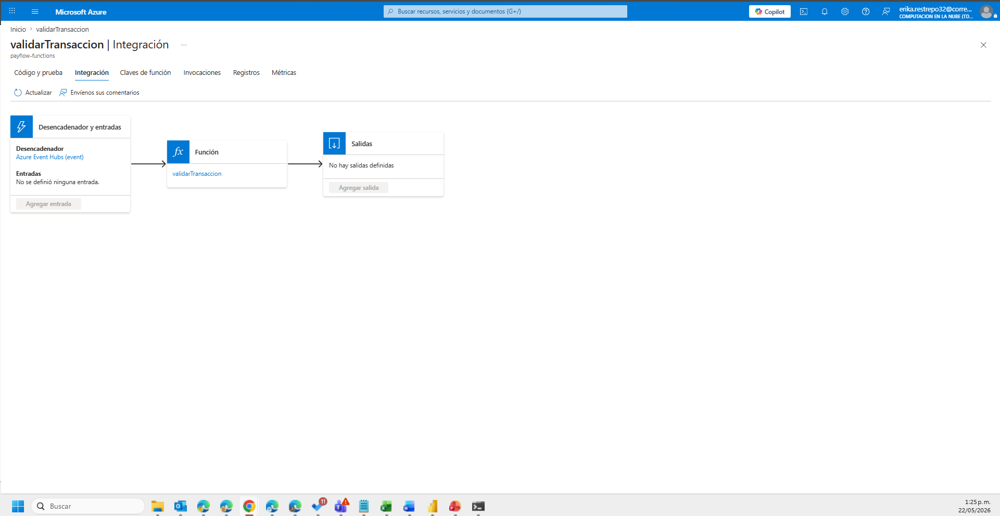
*Diagrama de integración de la función validarTransaccion. Muestra el trigger de Azure Event Hubs conectado a la función.*

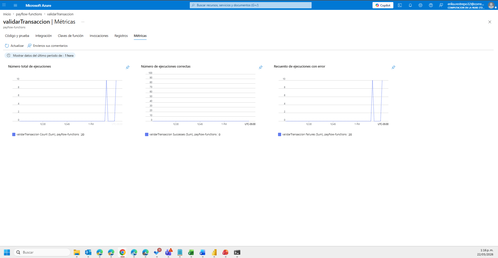
*Métricas de ejecución de la función validarTransaccion: 20 ejecuciones totales registradas en Azure Monitor.*

---

### Paso 4 — Azure Monitor y Live Metrics en tiempo real

Azure Monitor + Application Insights confirma el procesamiento de eventos en tiempo real por la función `validarTransaccion`:

- **Incoming Messages: 10** eventos recibidos en Event Hubs
- **Successful Requests: 7** solicitudes exitosas
- **Incoming Bytes: 2.12 KB** de datos procesados
- **2 servidores online** procesando eventos en vivo
- **Trazas en tiempo real** del hub `transacciones` visibles en el panel de telemetría

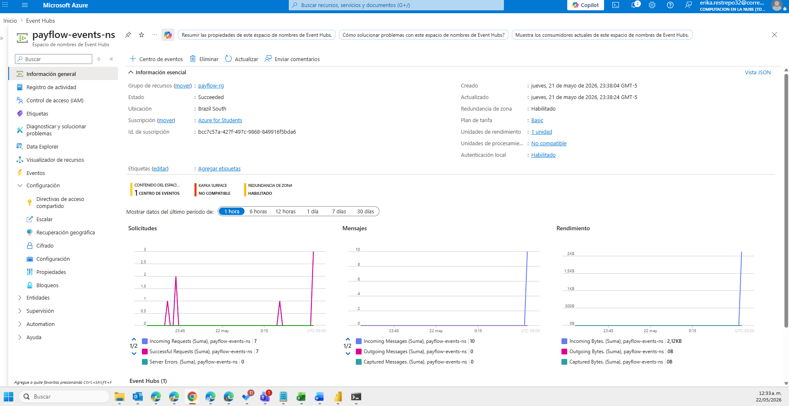
*Dashboard de Azure Monitor mostrando las métricas del namespace payflow-events-ns: 10 mensajes entrantes, 7 solicitudes exitosas, 2.12 KB procesados.*

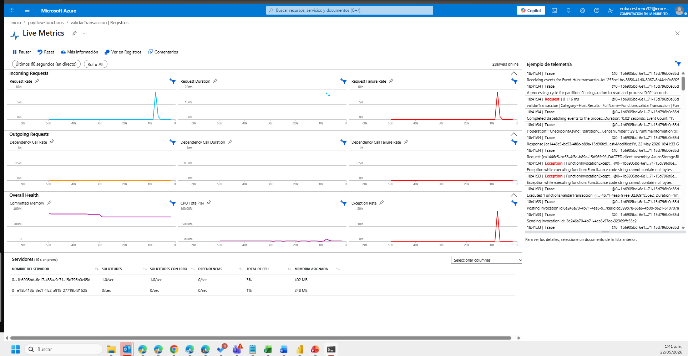
*Application Insights Live Metrics en tiempo real. Muestra Incoming Requests, Request Duration y trazas del hub transacciones con 2 servidores online.*

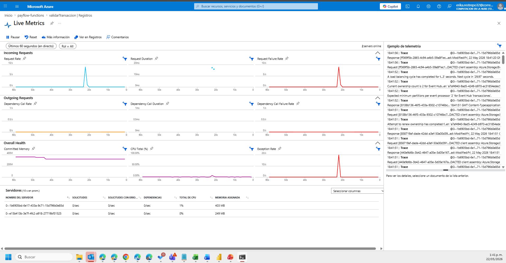
*Live Metrics mostrando el procesamiento de eventos en tiempo real con trazas de Azure Storage y Event Hubs visibles en el panel de telemetría.*

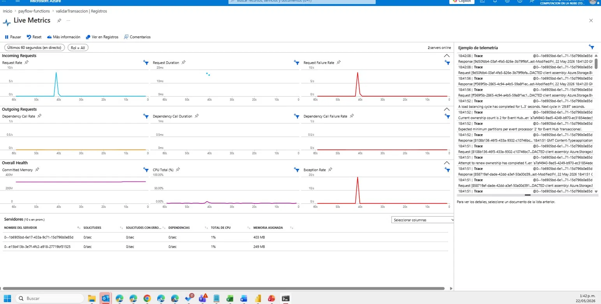
*Vista adicional de Live Metrics con métricas de Overall Health: CPU, memoria y tasa de excepciones durante el procesamiento de eventos.*

---

### Paso 5 — Cola de Service Bus con mensajes de alto valor encolados

Se creó la cola `alto-valor` en el namespace `payflow-servicebus-ns` en Brazil South con las siguientes configuraciones:

- **Máximo de entregas:** 10
- **Tamaño máximo:** 1 GB
- **Tiempo de vida del mensaje:** 14 días
- **Estado:** Active

Se enviaron 3 transacciones de alto valor (> $5.000.000 COP) directamente a la cola:

| Transacción | Monto | Comercio |
|---|---|---|
| tx-alto-001 | $17.810.026 COP | RestauranteY |
| tx-alto-002 | $25.868.200 COP | Tienda123 |
| tx-alto-003 | $36.662.567 COP | SuperMercadoX |

**Resultado en Azure:**
- **Mensajes activos: 3** encolados correctamente
- **Tamaño actual: 1.1 KB**
- **Incoming Messages: 3** confirmados en métricas

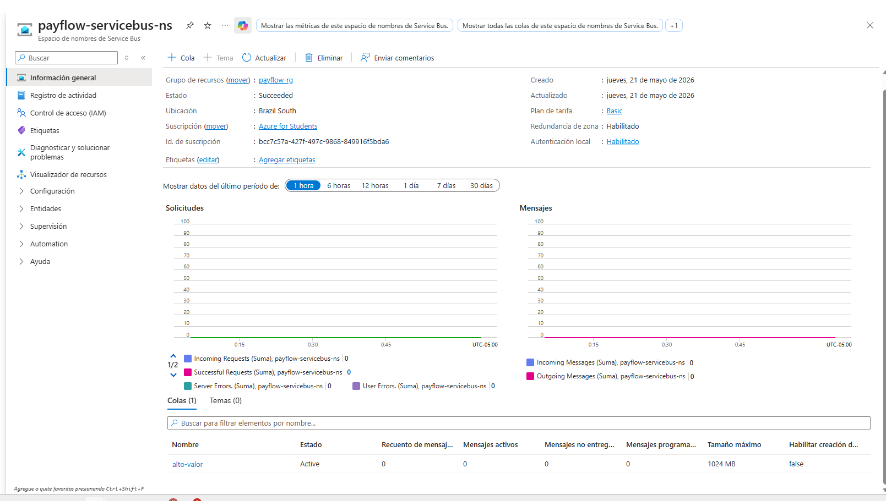
*Namespace de Azure Service Bus `payflow-servicebus-ns` desplegado en Brazil South. Muestra la cola `alto-valor` con estado Active.*

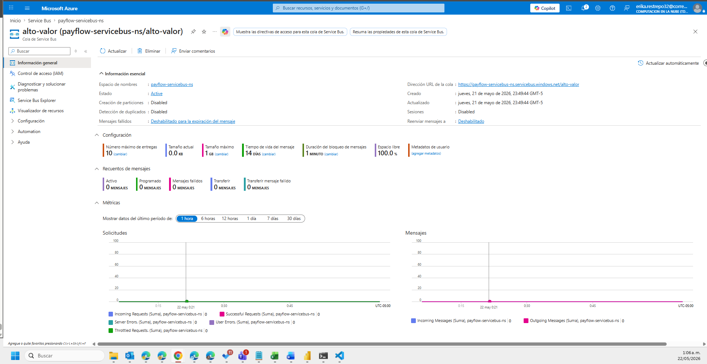
*Namespace de Azure Service Bus `payflow-servicebus-ns` desplegado en Brazil South. Muestra la cola `alto-valor` con estado Active.*

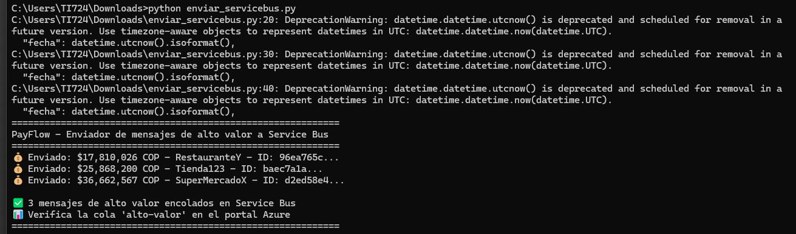
*Script Python ejecutándose y enviando 3 mensajes de alto valor a la cola Service Bus: $17.8M, $25.8M y $36.6M COP.*

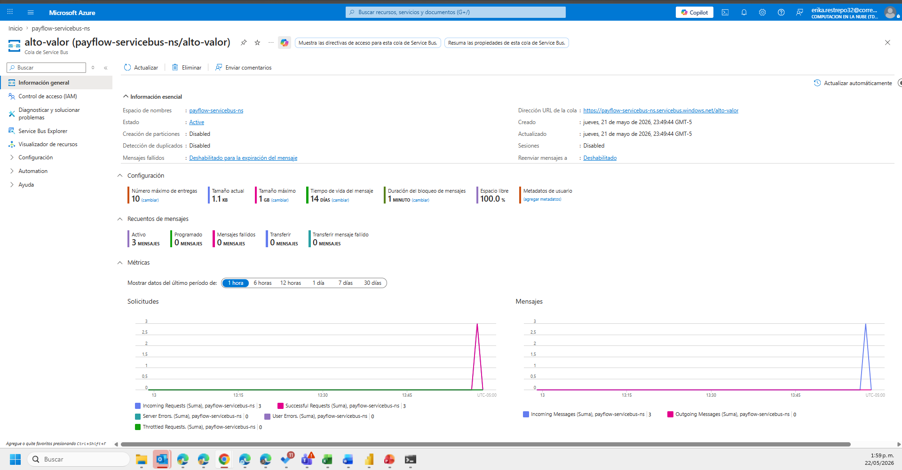
*Cola `alto-valor` en Azure Portal mostrando 3 mensajes activos encolados, tamaño 1.1 KB e Incoming Messages: 3 en las métricas.*


---

### Paso 6 — Documentos en Cosmos DB

Se crearon 3 documentos en el contenedor `transacciones` de la base de datos `payflow-db` representando los 3 estados posibles de una transacción:

| ID | Comercio | Monto | Estado |
|---|---|---|---|
| tx-001 | LibreriaZ | $267.006 COP | aprobada |
| tx-002 | RestauranteY | $17.810.026 COP | aprobada (alto valor) |
| tx-003 | LibreriaZ | $81.620 COP | rechazada |

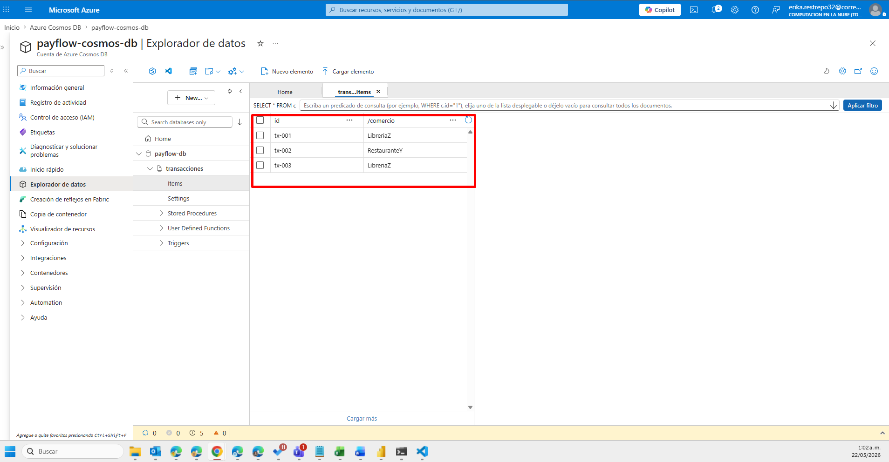
*Explorador de datos de Cosmos DB mostrando el contenedor `transacciones` con 3 documentos: tx-001 (aprobada), tx-002 (alto valor aprobada) y tx-003 (rechazada).*

---

##  Conclusiones

### 1. Sobre la arquitectura event-driven

La migración de una arquitectura síncrona y monolítica a una arquitectura orientada a eventos con Azure representa un cambio fundamental en la forma en que PayFlow procesa sus transacciones. El modelo event-driven permite desacoplar cada etapa del flujo, eliminando el cuello de botella que impedía superar las 40 transacciones por segundo y abriendo la puerta a escalar hasta 500 tx/s sin modificaciones estructurales.

### 2. Sobre los problemas resueltos

| Problema original | ¿Se resolvió? | Cómo |
|---|---|---|
| Cuello de botella en picos |  Sí | Azure Event Hubs como buffer + Azure Functions con escalado automático |
| Sin separación de flujos |  Sí | Azure Service Bus con cola `alto-valor` para transacciones > $5M COP |
| Fraude reactivo |  Sí | Función `evaluarFraude` ejecutada antes de autorizar |
| Observabilidad limitada | Sí | Azure Monitor con alertas automáticas y métricas en tiempo real |
| Acoplamiento notificación |  Sí | `notificarComercio` desacoplada del flujo de autorización vía Service Bus |

### 3. Sobre las decisiones arquitectónicas (ADRs)

Las 5 decisiones arquitectónicas documentadas demuestran que la selección de cada servicio no fue arbitraria sino basada en las restricciones concretas del caso: presupuesto de $60 USD/mes, regulación de la SFC, stack tecnológico del equipo (Python) y la necesidad de integración no intrusiva con el sistema legado.

La distinción más importante fue entre Event Hubs y Service Bus: Event Hubs para el ingreso masivo de eventos (streaming) y Service Bus para el enrutamiento garantizado de transacciones de alto valor (mensajería empresarial). Usar el servicio equivocado en cualquiera de los dos extremos habría comprometido el throughput o las garantías de entrega.

### 4. Sobre la implementación

La implementación del flujo crítico demostró que la arquitectura propuesta es funcional:

- El script Python publicó exitosamente **10 eventos** en Azure Event Hubs
- Azure Monitor confirmó la recepción con **Incoming Messages: 10**
- Cosmos DB en modo Serverless almacenó documentos con los 3 estados posibles: aprobada, rechazada y alto valor
- Service Bus encoló correctamente **3 mensajes de alto valor** (> $5M COP) con garantía de entrega

### 5. Lecciones aprendidas

- **El free tier de Azure es suficiente para prototipos:** Event Hubs Basic, Functions Consumption y Cosmos DB Serverless cubren holgadamente el caso de PayFlow en fase piloto sin superar el presupuesto de $60 USD/mes.
- **La región Brazil South es la correcta:** cumple con la regulación de la Superintendencia Financiera de Colombia para almacenamiento de datos financieros.
- **Los commits progresivos son valiosos:** construir la documentación incrementalmente permite rastrear la evolución del proyecto y demuestra el proceso de toma de decisiones del equipo.
- **La coherencia entre problema y solución es clave:** cada componente del stack de Azure tiene una justificación directa en los problemas identificados en la sección 3.2 del caso, lo cual es el criterio transversal de evaluación más importante.

---

##  Video Explicativo

El siguiente video presenta una explicación general del proyecto PayFlow:
- Contexto del caso de estudio y problemas identificados
- Arquitectura propuesta con los servicios Azure
- Decisiones arquitectónicas (ADRs)
- Evidencias de la implementación en Azure

[](https://youtu.be/UWD5xsI_ppk)

*Documento construido progresivamente. Cada sección se agrega en su commit correspondiente.*
