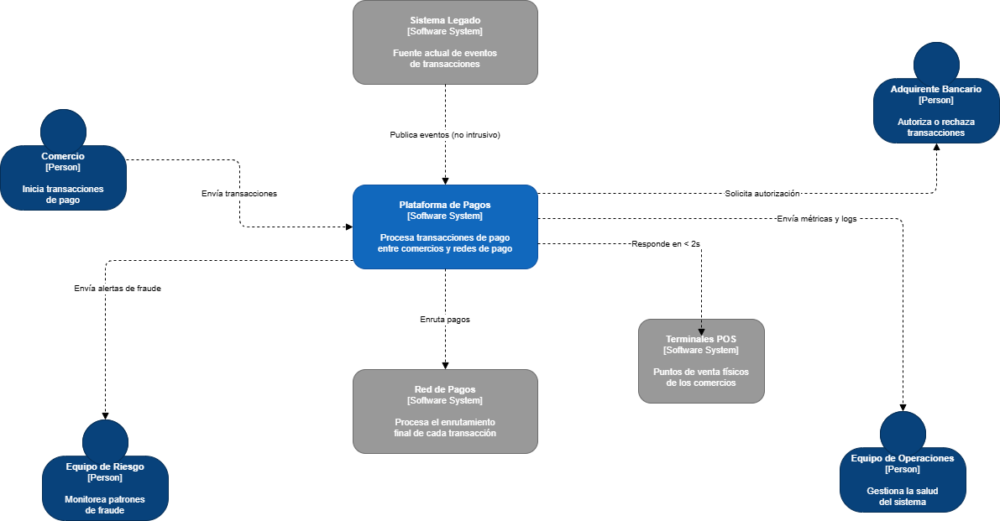

# Caso 3 · Procesamiento de Eventos en Tiempo Real — PayFlow

---

##  Ficha del Proyecto

| Campo | Detalle |
|---|---|
| **Institución** | Tecnológico de Antioquia — Institución Universitaria |
| **Curso** | Computación en la Nube · Semestre 2026-1 |
| **Profesor** | Julian David Florez Sanchez |
| **Caso** | 03 — Procesamiento de Eventos en Tiempo Real |
| **Empresa** | PayFlow (Fintech colombiana) |
| **Plataforma** | Microsoft Azure (Free Tier / Azure for Students) |
| **Inicio** | 21 de abril de 2026 |
| **Entrega** | 30 de mayo de 2026 |
| **Valor** | 20% de la nota final del curso |

---

## Integrantes

| Nombre |
|---|
| Erika Restrepo |
| Esteban Ramírez |
| Katerine Pino |

---

##  Estructura del Repositorio

```
/
├── README.md     → Documento principal con toda la documentación
├── /src/         → Código fuente: Azure Functions y scripts Python
└── /assets/      → Imágenes de diagramas C4 y capturas de pantalla
```

---

## Control de Cambios

| ID | Responsable | Observación / Cambio | Fecha |
|---|---|---|---|
| 01 | Julian David Florez | Creación del documento base | 02/05/2026 |
| 02 | Erika Restrepo | Estructura inicial del repositorio y portada | 21/05/2026 |
| 03 | Erika Restrepo | Análisis del caso — problemas, requerimientos y stack | 21/05/2026 |

---

## Análisis del Caso

### 1. Descripción de PayFlow

PayFlow es una **fintech colombiana** fundada en 2020 que actúa como intermediario de pagos digitales entre comercios, adquirentes bancarios y redes de pago (Visa, Mastercard, PSE). Procesa transacciones de compra, reembolsos, pagos de servicios y transferencias entre cuentas.

**Cifras de operación actuales:**

| Indicador | Valor |
|---|---|
| Comercios activos | 28.000 |
| Transacciones diarias (promedio) | 85.000 |
| Transacciones en temporada alta | hasta 260.000 por día |
| Presencia geográfica | Colombia, Ecuador y Perú |

---

### 2. Problemas Identificados en la Arquitectura Actual

El sistema actual fue construido en 2020 sobre una **arquitectura síncrona y monolítica**. Cada transacción recorre un flujo secuencial de validación → autorización → registro → notificación, que debe completarse en menos de 3 segundos. Esta arquitectura presenta cinco problemas críticos:

| # | Problema | Descripción | Impacto en el negocio |
|---|---|---|---|
| P1 | **Cuello de botella en picos** | El procesador central maneja hasta 40 tx/s. En temporada alta el tiempo de respuesta sube a 8 segundos. | Rechazos en terminales de comercios y pérdida de ventas. |
| P2 | **Sin separación de flujos** | Una transacción de $500 COP y una de $50.000.000 COP tienen exactamente la misma prioridad. | Micropagos masivos bloquean transacciones de alto valor. |
| P3 | **Fraude reactivo** | Las reglas antifraude se aplican *después* de autorizar. Las alertas son manuales y revisadas horas después. | El dinero ya está comprometido cuando se detecta el fraude. |
| P4 | **Observabilidad limitada** | No existe monitoreo centralizado. El equipo se entera de fallos por quejas en WhatsApp. | Tiempo de detección de problemas muy alto; daño a la reputación. |
| P5 | **Acoplamiento notificación** | Si el webhook de notificación al comercio falla, la transacción completa se revierte aunque la autorización bancaria fue exitosa. | Inconsistencias entre el estado en PayFlow y la red de pago. |

---

### 3. Requerimientos de la Nueva Arquitectura

| Requerimiento | Métrica objetivo | Motivación |
|---|---|---|
| Throughput | 500 transacciones/segundo | Soportar picos de temporada alta sin degradación |
| Latencia de autorización | < 2 segundos en P99 | Evitar timeouts en terminales de comercios |
| Garantía de entrega | At-least-once para transacciones críticas | Ninguna transacción puede perderse en el flujo |
| Detección de fraude | Evaluación en tiempo real **antes** de autorizar | Reducir a $0 el fraude comprometido post-autorización |
| Desacoplamiento | Notificaciones independientes del flujo de autorización | Evitar que fallos de webhook reviertan autorizaciones válidas |
| Observabilidad | Alertas automáticas con latencia < 30 segundos | Detectar anomalías antes de que los comercios reporten |

---

### 4. Restricciones del Proyecto

| Restricción | Detalle |
|---|---|
| **Regulación SFC** | Todos los datos deben almacenarse en Colombia o regiones certificadas. Región Azure: **Brazil South**. |
| **Stack tecnológico** | El equipo tiene experiencia en Python y Node.js. Las Azure Functions deben implementarse en uno de estos lenguajes. |
| **Presupuesto** | Máximo **$60 USD/mes** en Azure durante la fase piloto. |
| **Integración no intrusiva** | El sistema legado continúa operando en paralelo. La nueva arquitectura recibe sus eventos sin requerir modificaciones en él. |
| **Cosmos DB Free Tier** | Puede estar ocupado (una cuenta por suscripción). Se evalúa alternativa en ADR-03. |
| **Enrutamiento diferenciado** | Transacciones superiores a **$5.000.000 COP** deben ir por un canal de alta prioridad con registro de auditoría obligatorio. |

---

### 5. Stack de Servicios Azure

| Servicio Azure | Responsabilidad en PayFlow | Tier |
|---|---|---|
| **Azure Event Hubs** | Punto de entrada del sistema. Recibe el flujo de eventos del sistema legado y canales digitales. Actúa como buffer distribuido ante picos de demanda. | Basic (1 TU, 1 día retención) |
| **Azure Functions** | Procesa cada evento: valida formato, aplica reglas antifraude, enruta según monto y tipo, escribe resultado en Cosmos DB. | Consumption Plan (1M ejecuciones/mes gratis) |
| **Azure Service Bus** | Gestiona el enrutamiento diferenciado de transacciones de alto valor (> $5M COP) con colas de prioridad, garantía de entrega y reintentos automáticos. | Basic (costo mínimo por operación) |
| **Cosmos DB** | Persiste el estado final de cada transacción procesada con escrituras de alta velocidad. Modelo de datos flexible. | Free Tier (1.000 RU/s, 25 GB) |
| **Azure Monitor + App Insights** | Observabilidad completa: throughput de Event Hubs, tasa de error de Functions, latencia por tipo de transacción y alertas automáticas. | Gratuito hasta 5 GB logs/mes |

---

### 6. Correspondencia Problema → Solución Arquitectónica

Esta tabla demuestra que cada problema identificado tiene una solución concreta en la nueva arquitectura. Este es el criterio transversal de coherencia de la rúbrica.

| Problema original | Cómo lo resuelve la nueva arquitectura |
|---|---|
| P1 — Cuello de botella en picos | **Azure Event Hubs** actúa como buffer distribuido. **Azure Functions** en Consumption Plan escala automáticamente hasta 500 tx/s sin intervención manual. |
| P2 — Sin separación de flujos | **Azure Service Bus** con cola diferenciada para alto valor. La function `enrutarPorMonto` separa explícitamente transacciones > $5M COP antes de procesarlas. |
| P3 — Fraude reactivo | La function `evaluarFraude` aplica reglas antifraude **antes** de autorizar, dentro del flujo síncrono de Event Hubs → Functions. |
| P4 — Observabilidad limitada | **Azure Monitor + Application Insights** provee alertas automáticas con latencia < 30 s. Reemplaza las quejas en WhatsApp por dashboards en tiempo real. |
| P5 — Acoplamiento notificación | **Azure Service Bus** desacopla completamente la notificación al comercio. La function `notificarComercio` opera de forma independiente; su fallo no revierte la autorización. |

---

##  Modelo C4

### C1 — Diagrama de Contexto

El diagrama C1 muestra a PayFlow como sistema central, los actores del negocio y los sistemas externos con los que se integra.

#### Actores del negocio

| Actor | Rol en el sistema |
|---|---|
| **Comercio** | Inicia transacciones de compra, reembolso y pago de servicios a través de terminales POS y canales digitales. Es el actor principal. |
| **Adquirente bancario** | Entidad financiera que autoriza o rechaza cada transacción. PayFlow se comunica con él para obtener la autorización bancaria. |
| **Equipo de riesgo** | Monitorea patrones de fraude. Con la nueva arquitectura recibe alertas automáticas en tiempo real en lugar de revisarlas manualmente horas después. |
| **Equipo de operaciones** | Gestiona la salud del sistema. Recibe métricas y alertas automáticas desde Azure Monitor en lugar de enterarse por quejas en WhatsApp. |

#### Sistemas externos

| Sistema | Rol |
|---|---|
| **Sistema legado (monolito 2020)** | Fuente actual de eventos de transacciones. Se integra de forma no intrusiva a través de Azure Event Hubs, sin requerir modificaciones. |
| **Red de pagos (Visa / Mastercard / PSE)** | Procesa el enrutamiento final de cada transacción hacia la red de pago correspondiente. |
| **Terminales POS** | Puntos de venta físicos de los comercios. Reciben respuesta de autorización o rechazo en menos de 2 segundos (P99). |

#### Diagrama



> _Elaborado en draw.io con librería C4. Exportado y disponible en /assets/c1-contexto.png_

---

### C2 — Diagrama de Contenedores

> _En construcción — próximo commit._

---

### C3 — Diagrama de Componentes

> _En construcción — próximo commit._

---

##  Decisiones Arquitectónicas (ADRs)

> _En construcción — se documentarán 5 ADRs en el próximo commit._

---

##  Implementación del Flujo Crítico

> _En construcción — evidencias se agregarán conforme avance la implementación en Azure._

---

##  Conclusiones

> _Se completarán al finalizar la implementación._

---

*Documento construido progresivamente. Cada sección se agrega en su commit correspondiente.*
